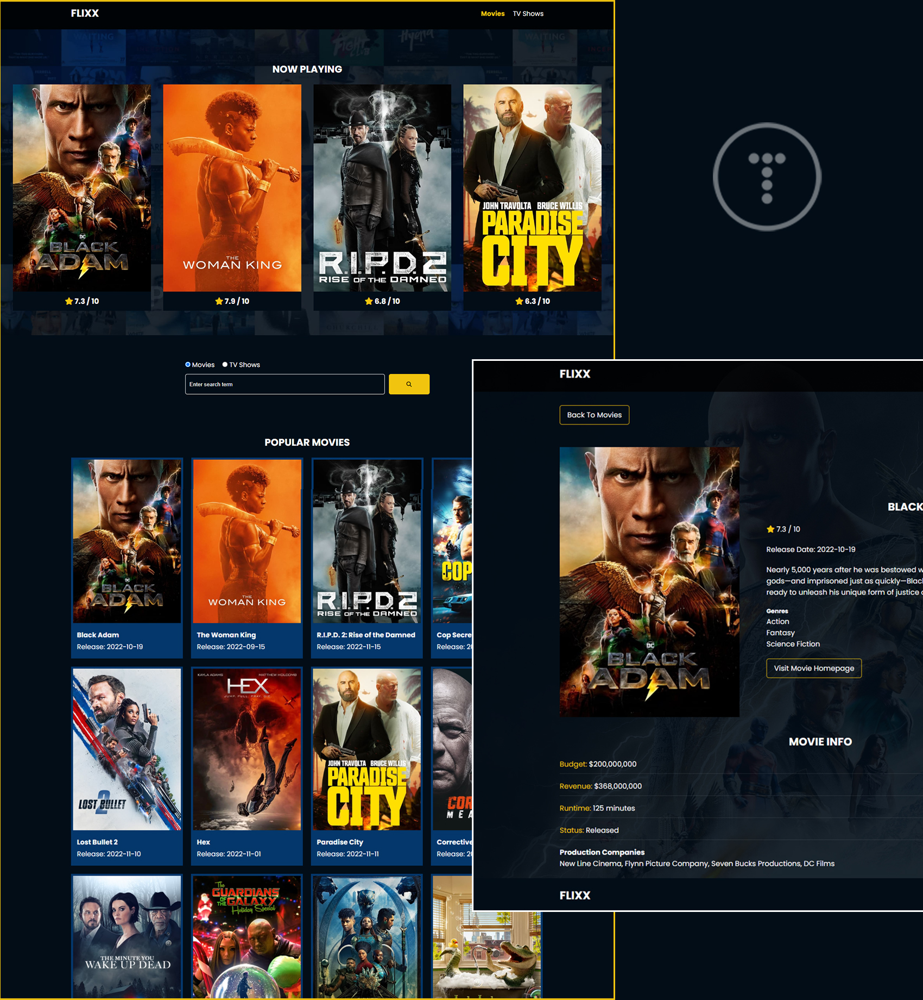

# Flixx App

Movie info application built with vanilla JavaScript that uses **version 3** of the [TMDB API](https://developers.themoviedb.org/3)

This is part of Brad Traversy's [**Modern JS From The Beginning 2.0**](https://github.com/bradtraversy/flixx-app) course



This includes the most popular movies and TV shows with detail pages, a search box for movies and shows with full pagination and a slider for movies that are currently playing in theaters. The slider uses the [Swiper](https://swiperjs.com) library.

## Usage

Just clone or download and then register for a free API key at https://www.themoviedb.org/settings/api

Once you get your key, to simplify local development create the file `js/env.js` and paste it there with the following content:

```Javascript
export const ENV = {
  API_KEY: "paste_your_super_secret_API_key_here",
};
```
